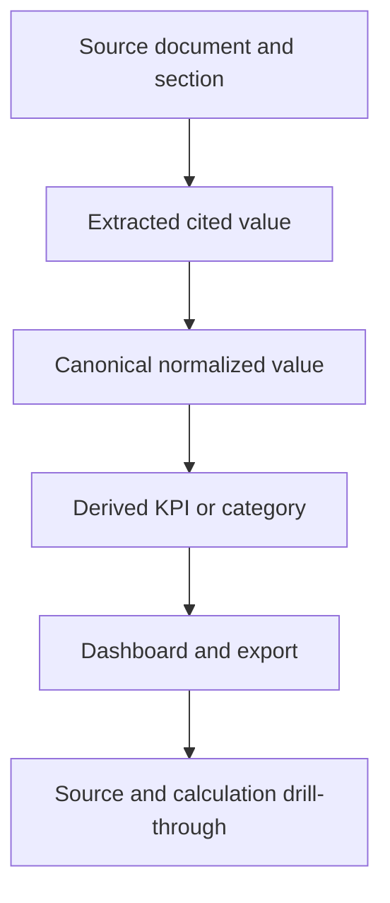

# Pharmaceutical Product Data Remediation

## Goal Capsule

- **Objective:** Replace the dashboard's loosely populated pharmaceutical metadata with source-backed, indication-aware product data and defensible commercial KPIs that align with the Product Uptake Demo.
- **Authority:** FDA and DailyMed labeling govern approval, indication, route, and approved LoT; SEC and company IR govern observed product sales; deterministic calculations govern derived metrics; licensed consensus or explicit analyst imports govern forward peak estimates.
- **Execution profile:** Cross-cutting schema, ingestion, analytics, API, export, and dashboard work delivered in dependency order with backward-compatible reads during migration.
- **Stop conditions:** Do not infer MoA from EPC, infer first-line use from absent label language, merge distinct formulations solely because they share an active ingredient, or present forecast peak sales as observed fact.
- **Tail ownership:** The implementing agent owns migrations, backfill tooling, automated verification, dashboard manual verification, documentation, commits, push, and PR updates.

---

## Product Contract

### Summary

The workbench currently exposes several dashboard fields that are absent, semantically wrong, or too flat for pharmaceutical analysis. Most notably, Established Pharmacologic Class is used as a fallback for MoA, LoT is treated as a product-level scalar, competitive intensity is absent, formulations are deduplicated by name, and peak/uptake fields have no calculation lineage.

The remediation creates a structured product model, retrieves authoritative FDA label content, adds deterministic and cited commercial analytics, and updates the dashboard to present launch-relative uptake with reference-aligned filters and KPIs.

### Problem Frame

The Product Uptake Demo compares products across therapeutic areas using company, approval period, competitive intensity, route, MoA, peak-sales potential, indication count, and launch-relative uptake. The workbench currently centers on PAH product revenue extraction and a flat `drug_profile_fields` EAV model. Filling empty columns through additional LLM output would make the UI look complete without making the data reliable. The remediation must first establish correct pharmaceutical semantics and provenance.

### Requirements

#### Product identity and clinical structure

- R1. Represent canonical product, active moiety, formulation, delivery device, and analog family separately so related formulations can be grouped without being financially merged.
- R2. Represent indications as one-to-many records with disease, therapeutic area, setting, population, biomarker, approval date, and citation.
- R3. Preserve current commercial owner, regulatory sponsor, and manufacturer as distinct attributes when sources provide them.
- R4. Store every source-derived field with source URL, source section or field path, quote where applicable, retrieval/as-of date, confidence, validation status, and extraction method.

#### MoA and route

- R5. Store FDA EPC and MoA as distinct concepts; dashboard and export MoA must never fall back to EPC.
- R6. Preserve multiple active ingredients and multiple MoA components for combination products while providing a curated, cited display summary.
- R7. Preserve all approved routes and formulations and normalize them to controlled display categories without dropping source terms.

#### Approved LoT

- R8. Store approved LoT per indication and setting, derived only from explicit FDA/DailyMed label language such as first-line or required prior therapies.
- R9. Distinguish `1L`, `2L+`, `3L+`, `subsequent_unspecified`, `all_lines_or_unspecified`, `not_applicable`, and `unresolved`; lack of prior-treatment wording must not become `1L`.
- R10. Keep approved LoT separate from guideline-recommended LoT and real-world observed LoT.

#### Commercial metrics

- R11. Preserve observed, consensus, and modeled peak-sales values as separate typed estimates with geography, revenue scope, currency, as-of date, and lineage.
- R12. Select the dashboard peak using lifecycle-aware policy: observed peak for demonstrably mature products, current cited consensus for launched/growing products, and cited patient-based forecast for pre-launch or sparse-history products.
- R13. Calculate time-to-peak as time from commercial launch to first period reaching 90% of selected/observed peak, with the peak type visible.
- R14. Calculate revenue-proxy uptake as rolling-four-quarter net product sales divided by selected annual peak; mark early periods without four quarters as insufficient rather than silently annualizing.
- R15. Prefer treated-patient or prescription uptake when licensed volume data exists and label revenue-derived uptake explicitly.

#### Competitive intensity

- R16. Calculate competitive intensity for a specific product launch, geography, indication, population, and LoT using the market state as of launch.
- R17. Preserve the score inputs: approved direct competitors, indirect standard-of-care alternatives, generic/biosimilar presence, same-MoA and same-route counts, order of entry, follower launches, and near-term late-stage entrants when available.
- R18. Derive Low/Medium/High from therapeutic-area or indication cohort percentiles; preserve the raw score and peer list so the category is auditable.

#### Dashboard and export

- R19. Provide reference-aligned filters for product, therapeutic area, company, initial FDA approval period, competitive intensity, RoA, MoA, peak-sales bucket, and approved-indication count.
- R20. Provide filtered-cohort KPIs for products tracked, companies represented, aggregate selected peak sales with coverage, and products with usable uptake data.
- R21. Provide launch-relative uptake and 24-month views while retaining calendar quarterly/annual views and source drill-through.
- R22. Product tables and exports must expose the same canonical dimensions, calculation methods, citations, and missing-data states as the API.
- R23. Observability must include the new normalized tables and derivation records without regressing live logs, database browsing, run errors, or recent-run views.

### Acceptance Examples

- AE1. Given a product whose OpenFDA record contains an EPC but no label MoA, when metadata is assembled, then EPC is shown only as pharmacologic class and MoA remains unresolved instead of copying EPC.
- AE2. Given a combination therapy such as an INSTI plus two NRTIs, when label metadata is parsed, then all active components and MoA components are retained and the display summary represents the combination.
- AE3. Given one product approved first-line for one indication and after two prior lines for another, when the dashboard is filtered, then each indication retains its own LoT and no product-level LoT overwrites either.
- AE4. Given PAH products sharing treprostinil but using oral, infused, nebulized, and DPI formulations, when analogs are grouped, then they share an analog family but remain distinct commercial products.
- AE5. Given a growing product with a cited consensus peak and incomplete observed history, when KPIs are calculated, then consensus peak is selected, its type and as-of date are visible, and observed TTM is not labeled peak.
- AE6. Given an indication with multiple direct competitors at launch and several near-term followers, when competitive intensity is calculated, then the peer list, component counts, raw score, cohort percentile, and High/Medium/Low label are all inspectable.
- AE7. Given a product with fewer than four reported quarters, when launch-relative revenue uptake is requested, then early rolling-four-quarter uptake values are missing with an explicit insufficient-history reason.

### Scope Boundaries

#### In scope

- Public-source ingestion from Drugs@FDA, OpenFDA Label, DailyMed, SEC, company IR, and ClinicalTrials.gov where needed for late-stage competitor context.
- Manual, cited import for licensed consensus forecasts or analyst assumptions.
- Structured schema, migrations, backfill, quality gates, API/export contracts, and dashboard alignment.
- Existing PAH seed as the first regression cohort, plus a small multi-therapeutic-area gold metadata cohort for MoA and LoT coverage.

#### Deferred to follow-up work

- Direct paid integrations with Evaluate Pharma, IQVIA, GlobalData, claims, prescription, or patient-level data vendors until licensing and credentials are supplied.
- Guideline LoT ingestion from NCCN or other licensed clinical guidelines.
- Real-world LoT derivation from claims/EHR treatment events.
- Full global product registry coverage; the initial registry is the curated/imported workbench cohort.

#### Outside this product's identity

- Clinical decision support or treatment recommendations.
- Patient-specific eligibility determination.
- Uncited LLM-generated commercial forecasts presented as confirmed facts.

### Sources

- FDA pharmacologic class distinguishes EPC from MoA, physiologic effect, and chemical structure: https://www.fda.gov/industry/structured-product-labeling-resources/pharmacologic-class
- OpenFDA harmonized fields include separate `pharm_class_epc` and `pharm_class_moa`: https://open.fda.gov/apis/openfda-fields/
- OpenFDA Drug Label provides Structured Product Label sections: https://open.fda.gov/apis/drug/label/
- FDA labels express first-line and prior-treatment constraints in Indications and Usage; example: https://dailymed.nlm.nih.gov/dailymed/drugInfo.cfm?setid=5e81b4a7-b971-45e1-9c31-29cea8c87ce7
- IQVIA defines competitive intensity using follower count and speed of entry: https://www.iqvia.com/-/media/iqvia/pdfs/emea/emea-thought-leadeship/launch-environment-for-tl-website.pdf
- IQVIA historical analog guidance emphasizes indication, order of entry, unmet need, and market crowding: https://www.iqvia.com/blogs/2021/10/using-historical-analogues-to-forecast-new-product-launches
- Peak annual sales and time-to-90%-of-peak benchmark: https://link.springer.com/article/10.1007/s43441-026-00954-8
- Patient-based forecasting combines epidemiology, available patients, share, persistence, and price: https://www.iqvia.com/blogs/2022/02/bridging-the-divide-between-demand--and-patient-based-forecasting

---

## Planning Contract

### Key Technical Decisions

- KTD1. **Normalized core with EAV compatibility.** Add normalized tables for product identity, formulation, indications, MoA, peak estimates, competitor snapshots, and uptake points. Keep `drug_profile_fields` readable during migration and use it only for simple scalar metadata.
- KTD2. **Alembic becomes authoritative.** `Base.metadata.create_all()` cannot alter existing SQLite schemas. Establish an Alembic baseline and migrate existing databases before adding normalized entities.
- KTD3. **Deterministic extraction before LLM interpretation.** Parse structured FDA/DailyMed fields and label sections first. Use LLM extraction only for bounded label interpretation, with explicit source text and review state.
- KTD4. **No semantic fallback.** EPC, MoA, LoT, peak type, and competitive intensity remain distinct even when that creates visible unresolved values.
- KTD5. **Formulation-aware identity.** Dedupe exact canonical products; group by analog family separately. Active-moiety equality alone never merges revenue series.
- KTD6. **Indication is the commercial analysis grain.** LoT and competitive intensity are indication-specific. Product-level summaries aggregate but do not overwrite indication records.
- KTD7. **Peak estimates are typed.** Observed, consensus, and modeled peaks coexist. A selection policy chooses the dashboard value and records why.
- KTD8. **Competitive intensity is computed, not prompted.** LLMs may normalize evidence but do not assign Low/Medium/High directly. A deterministic scored snapshot and cohort percentile produce the category.
- KTD9. **Backward-compatible dashboard contract.** Extend `/dashboard/preview` with normalized product/indication summaries, KPIs, and launch series while preserving existing `products`, `series`, citation drill fields, and Observability routes during rollout.
- KTD10. **Launch anchors are explicit.** Prefer a cited commercial launch date from company IR; otherwise use the indication-specific FDA approval date; use initial product approval only for product-level views. Persist `anchor_type` so approval and commercial availability are never conflated.
- KTD11. **Reviewed assertions win.** A confirmed reviewer assertion is immutable to automated backfill. Among unreviewed assertions, deterministic structured extraction outranks bounded LLM interpretation, then source priority, confidence, and recency break ties.
- KTD12. **Frontend behavior receives automated coverage.** Add a lightweight Vitest and React Testing Library harness for filter intersections, KPI updates, tab switching, empty states, and source drawer behavior; browser walkthrough remains the end-to-end proof.

### High-Level Technical Design

```mermaid
flowchart TB
  Inputs[CSV and run inputs] --> Identity[Canonical identity and formulation resolver]
  FDA[Drugs@FDA and OpenFDA Label] --> Label[Label section parser]
  DailyMed[DailyMed SPL] --> Label
  SEC[SEC and company IR] --> Sales[Observed product sales]
  Manual[Consensus or analyst import] --> Peak[Typed peak estimates]
  Trials[ClinicalTrials.gov optional late-stage context] --> Competition[Competitive snapshots]

  Identity --> Products[(Products and formulations)]
  Label --> Indications[(Product indications and approved LoT)]
  Label --> Mechanisms[(MoA components and EPC)]
  Sales --> Observations[(Sales observations)]
  Products --> Competition
  Indications --> Competition
  Observations --> Peak
  Peak --> Uptake[Launch-relative uptake derivation]

  Products --> API[Dashboard and export projection]
  Indications --> API
  Mechanisms --> API
  Competition --> API
  Peak --> API
  Uptake --> API
```



### Sequencing

1. Establish migration and domain foundations.
2. Correct MoA/EPC immediately, then add label ingestion and identity.
3. Add indication-specific LoT.
4. Add typed peak sales and uptake calculations.
5. Add competitive snapshots after indication and identity are stable.
6. Project normalized data into API, exports, dashboard, and Observability.
7. Backfill, verify, and document rollout behavior.

### Risks and Mitigations

| Risk | Mitigation |
|---|---|
| Existing SQLite databases lack new columns/tables | Alembic baseline, migration smoke test, and explicit local reset/backfill tooling |
| Brand-name matching selects the wrong label | Resolve through NDA/BLA, application number, NDC, RxCUI, or SPL set ID before name fallback |
| Label wording does not identify exact LoT | Preserve `subsequent_unspecified` or `unresolved`; route uncertain interpretations to review |
| Product revenue combines formulations or geographies | Require revenue scope, geography, product family/formulation scope, and source lineage before peak calculation |
| Run-local competitor cohort understates the market | Calculate against the persisted product/indication registry and expose cohort coverage; do not call incomplete runs global |
| Consensus sources are licensed or unavailable | Provide cited manual import and patient-model input contract; never scrape or fabricate restricted data |
| Launch-relative comparison mixes patient uptake and revenue | Expose metric type and methodology; never put unlike measures in one unlabeled series |
| Broad schema change destabilizes existing review/export flows | Add backward-compatible reads, backfill tests, and retain current citation JSON until normalized lineage is proven |

### Calculation Contracts

#### Launch dates

- `initial_approval_date`: earliest approved original Drugs@FDA submission.
- `indication_approval_date`: approved supplement or original submission date matched to the indication through FDA approval letters and contemporaneous label text.
- `commercial_launch_date`: explicit company IR or earnings-release date stating commercial availability.
- Uptake uses `commercial_launch_date`, then `indication_approval_date`; if both are absent, the indication is excluded from launch-relative series with a reason.

#### Peak selection

1. Build comparable annual and rolling-four-quarter series only after geography, currency, revenue scope, formulation/family scope, and fiscal/calendar basis match.
2. Select observed peak only when at least three comparable annual periods exist and two consecutive later annual periods are non-growing or at or below 90% of the observed maximum.
3. Otherwise select a consensus peak whose as-of date is within 12 months. For multiple harmonized consensus sources, use the median annual peak and preserve each input; conflicting scope is not pooled.
4. Otherwise select a cited patient-based modeled peak.
5. If no valid estimate exists, return unresolved with coverage reason. Do not convert currencies unless the FX observation and conversion period are stored in lineage.

#### Competitive intensity v1

For the product-indication launch cohort:

- Direct approved competitor with matching indication, setting/population, and LoT: `1.00`.
- Indirect approved standard-of-care alternative in the same clinical setting: `0.50`.
- Generic or biosimilar competitor directly substitutable in the setting: `0.75`.
- Unique Phase 3 asset expected to enter within 24 months: `0.25`.
- Same-MoA count, same-route count, order of entry, previous-launch gap, and follower launches remain explanatory dimensions and are not added again to the score.

`raw_score = direct + 0.5 × indirect + 0.75 × substitutable + 0.25 × near_term_phase3`.

Within a cohort of at least six launches, Low is at or below the 33rd percentile, Medium is above the 33rd through the 67th percentile, and High is above the 67th percentile. For smaller cohorts, use provisional thresholds Low `<2`, Medium `2 to <5`, High `>=5`, set `low_coverage=true`, and expose cohort size. Persist `formula_version="competitive_intensity_v1"`.

---

## Implementation Units

### U1. Migration and pharmaceutical domain foundation

- **Goal:** Introduce migration discipline and normalized entities without breaking existing runs.
- **Requirements:** R1-R4, R11, R16-R18.
- **Dependencies:** None.
- **Files:**
  - `backend/alembic.ini`
  - `backend/alembic/env.py`
  - `backend/alembic/versions/001_baseline.py`
  - `backend/alembic/versions/002_pharma_domain.py`
  - `backend/app/db/models.py`
  - `backend/app/domain/models.py`
  - `backend/app/observability.py`
  - `backend/tests/test_migrations.py`
  - `backend/tests/test_domain_models.py`
- **Approach:**
  1. Baseline the current schema and make migrations the authoritative startup path.
  2. For existing unversioned databases, compare an expected current-schema fingerprint before stamping the baseline; stop with remediation guidance rather than stamping an unknown schema. Fresh databases upgrade normally.
  3. Exercise the same revisions against SQLite and PostgreSQL-compatible test engines; keep SQLite batch migration support enabled where table recreation is required.
  4. Add canonical products, analog families, formulations, product indications, MoA components, peak estimates, competitive snapshots, uptake metrics, evidence assertions, and derivation lineage.
  5. Use stable identifiers and uniqueness constraints that permit one product to have multiple formulations, indications, and mechanisms.
  6. Register normalized tables in Observability, including the currently omitted `drug_profile_fields`.
- **Execution note:** Add migration characterization tests before modifying startup behavior.
- **Patterns to follow:** SQLAlchemy declarative models and UUID string IDs in `backend/app/db/models.py`; Pydantic enums and cited values in `backend/app/domain/models.py`.
- **Test scenarios:**
  - Upgrade a database created from the current baseline and verify all old rows remain readable.
  - Refuse to stamp an unversioned database whose schema fingerprint differs from the expected baseline.
  - Initialize an empty SQLite database and verify all baseline and normalized tables exist.
  - Apply the revisions against a PostgreSQL test database when `DATABASE_URL` is available in CI.
  - Insert one product with two formulations and two indications and verify constraints permit the intended cardinality.
  - Attempt duplicate canonical identity keys and verify the chosen uniqueness rule rejects or upserts consistently.
  - Query every new table through the Observability database registry.
- **Verification:** Existing and new databases start cleanly; normalized cardinalities are representable; old API reads remain functional.

### U2. Authoritative label ingestion, product identity, and MoA correction

- **Goal:** Separate EPC from MoA and populate canonical identity, formulation, route, and multi-component mechanism from FDA label sources.
- **Requirements:** R1, R3-R7.
- **Dependencies:** U1.
- **Files:**
  - `backend/app/connectors/openfda.py`
  - `backend/app/connectors/openfda_fields.py`
  - `backend/app/connectors/dailymed.py`
  - `backend/app/parsing/fda_label.py`
  - `backend/app/identity/resolver.py`
  - `backend/app/identity/analog_families.yaml`
  - `backend/app/pipeline/orchestrator.py`
  - `backend/app/prompts/metadata_extractor.yaml`
  - `backend/app/llm/client.py`
  - `backend/app/quality/checks.py`
  - `backend/tests/fixtures/spl/`
  - `backend/tests/test_openfda_class_mapping.py`
  - `backend/tests/test_fda_label_parser.py`
  - `backend/tests/test_product_identity.py`
  - `backend/tests/test_metadata_pipeline.py`
- **Approach:**
  1. Retrieve OpenFDA Label/DailyMed SPL in addition to Drugs@FDA and resolve records through regulatory identifiers before names.
  2. Parse active ingredients, application identifiers, routes, dosage forms, Indications section, and Mechanism of Action section deterministically.
  3. Persist EPC, FDA MoA terms, descriptive MoA text, and component MoAs separately.
  4. Resolve canonical product/formulation/analog-family identity and replace name-only dashboard dedupe with canonical product identity.
  5. Remove EPC-to-MoA fallback from dashboard and export projections and add a high-severity quality check for semantic contamination.
  6. Persist field assertions separately from source evidence and derivations: source evidence identifies document/section/quote; field assertions identify canonical field/value/method/review state; derivations link output assertions to input assertions.
- **Execution note:** Begin with fixtures representing a single-agent product, a combination product, and related formulations sharing one active moiety.
- **Patterns to follow:** Connector result/status behavior in `backend/app/connectors/openfda.py`; deterministic extraction before LLM metadata handling in `backend/app/pipeline/orchestrator.py`.
- **Test scenarios:**
  - Parse separate EPC and MoA arrays and verify neither overwrites the other.
  - Parse a combination label and retain every active ingredient and MoA component.
  - Resolve Tyvaso formulations into one analog family with distinct formulation identities.
  - Handle a missing or ambiguous DailyMed match without attaching the wrong label.
  - Reject a candidate MoA equal to an EPC value and create a reviewable quality issue.
  - Ensure dashboard/export MoA remains unresolved when only EPC exists.
  - Run automated extraction after a reviewer-confirmed MoA and verify the reviewed assertion remains selected and unchanged.
- **Verification:** MoA is source-backed and semantically distinct; routes/formulations are complete; canonical dedupe does not merge distinct commercial products.

### U3. Indication normalization and approved LoT

- **Goal:** Replace flat indication/LoT fields with indication-specific regulatory records.
- **Requirements:** R2, R4, R8-R10.
- **Dependencies:** U1, U2.
- **Files:**
  - `backend/app/parsing/indications.py`
  - `backend/app/prompts/lot_extractor.yaml`
  - `backend/app/llm/client.py`
  - `backend/app/pipeline/orchestrator.py`
  - `backend/app/quality/checks.py`
  - `backend/tests/test_indications.py`
  - `backend/tests/test_indication_lot.py`
  - `seed/gold/metadata.jsonl`
- **Approach:**
  1. Split the label Indications section into indication records carrying disease, setting, population, biomarker, regimen context, and approval date.
  2. Match each indication to its original or supplemental approval using Drugs@FDA submissions, FDA approval letters, and contemporaneous label text; do not treat the latest label effective date as the indication approval date.
  3. Apply deterministic phrase rules for explicit first-line and numeric prior-line language.
  4. Use bounded LLM interpretation only for complex prior-treatment clauses, preserving source quote and interpreted/review status.
  5. Assign explicit missing states and keep approved, guideline, and observed LoT namespaces separate.
- **Patterns to follow:** Cited field extraction and validation-task creation in the current metadata/evidence pipeline.
- **Test scenarios:**
  - Map explicit first-line language to `1L`.
  - Map one prior regimen to `2L+` and two prior lines to `3L+`.
  - Map vague “previously treated” language to `subsequent_unspecified`.
  - Map label silence to `all_lines_or_unspecified`, not `1L`.
  - Mark non-LoT therapeutic areas `not_applicable` where the configured taxonomy supports that conclusion.
  - Preserve different LoT values for two indications of the same product.
  - Resolve an initial product approval and later indication expansion to different indication approval dates.
  - Route conflicting or ambiguous label clauses to review with the original quote.
- **Verification:** Every LoT value is indication-scoped, citation-backed, and uses a controlled state with no product-level overwrite.

### U4. Typed peak sales and launch-relative uptake analytics

- **Goal:** Produce defensible observed, consensus, and modeled peak values and calculate lifecycle-aware uptake metrics.
- **Requirements:** R11-R15.
- **Dependencies:** U1, U2, U3.
- **Files:**
  - `backend/app/analytics/peak_sales.py`
  - `backend/app/analytics/uptake.py`
  - `backend/app/imports/peak_sales.py`
  - `backend/app/pipeline/orchestrator.py`
  - `backend/app/quality/checks.py`
  - `backend/app/export/builder.py`
  - `backend/tests/test_peak_sales.py`
  - `backend/tests/test_uptake_metrics.py`
  - `backend/tests/test_peak_sales_import.py`
- **Approach:**
  1. Aggregate comparable product-scoped quarterly observations into annual and rolling-four-quarter net sales without mixing geography, currency, product family, or alliance scope.
  2. Store actual/observed, licensed-consensus/manual, and patient-modeled peaks separately.
  3. Add a cited import contract for consensus or analyst assumptions; do not add vendor-specific scraping.
  4. Select a dashboard peak through the Calculation Contracts policy and preserve method, as-of date, confidence, and coverage.
  5. Calculate time-to-90%-of-peak and rolling-four-quarter revenue-proxy uptake; emit explicit missing reasons for sparse history.
- **Execution note:** Implement analytics as pure functions first, then integrate persistence and API projection.
- **Patterns to follow:** Revenue scope and normalized USD fields on `DatapointORM`; source-audit requirements in `backend/app/export/builder.py`.
- **Test scenarios:**
  - Calculate observed peak from complete, comparable annual product revenue.
  - Exclude company-total, franchise, mixed-geography, and unresolved-scope rows.
  - Select observed peak for a mature product and consensus peak for a growing product according to policy.
  - Refuse to combine fiscal-year and calendar-year series or incompatible geography/scope.
  - Select the median of multiple current, harmonized consensus sources while retaining every source input.
  - Leave cross-currency values unresolved until a cited period-compatible FX conversion exists.
  - Reject consensus import rows without source, as-of date, geography, or revenue scope.
  - Calculate first date reaching 90% of peak.
  - Calculate rolling-four-quarter uptake and return insufficient history for quarters one through three.
  - Preserve separate peak values for product family and formulation-specific revenue.
  - Trace each derived value to the exact datapoint IDs used.
- **Verification:** Peak fields are typed and auditable; no TTM value is mislabeled as forecast peak; uptake methodology is visible and reproducible.

### U5. Indication-specific competitive landscape

- **Goal:** Compute an auditable competitive-intensity snapshot at each product launch.
- **Requirements:** R16-R18.
- **Dependencies:** U1-U3.
- **Files:**
  - `backend/app/analytics/competitive_intensity.py`
  - `backend/app/connectors/clinicaltrials.py`
  - `backend/app/jobs/run_status.py`
  - `backend/app/main.py`
  - `backend/tests/test_competitive_intensity.py`
  - `backend/tests/test_competitor_registry.py`
- **Approach:**
  1. Build peer cohorts from persisted canonical products and indications rather than only the current run.
  2. Populate the registry from FDA-approved product-indication records and explicit standard-of-care classifications; include the registry coverage and as-of date in every snapshot.
  3. Compute approved direct and indirect competitors as of launch, order of entry, previous-launch gap, same-MoA/route counts, and follower velocity.
  4. Optionally enrich near-term pressure with deduplicated active Phase 3 sponsor/asset programs from ClinicalTrials.gov, keeping this component visibly partial.
  5. Apply `competitive_intensity_v1` from Calculation Contracts and persist peer IDs, classifications, component values, percentile, cohort size, and low-coverage state.
  6. Trigger recalculation after registry updates rather than assigning intensity through the metadata prompt.
- **Patterns to follow:** Run-level aggregate updates in `backend/app/jobs/run_status.py`; deterministic analytics modules introduced in U4.
- **Test scenarios:**
  - Count only competitors approved before the target launch for intensity-at-launch.
  - Separate direct same-indication/setting/LoT peers from indirect alternatives.
  - Preserve different intensity snapshots for two indications of one product.
  - Verify order of entry and follower-within-24-month counts.
  - Deduplicate multiple ClinicalTrials.gov records for one sponsor/asset program.
  - Produce stable percentile buckets for a fixed cohort and expose low-coverage state for undersized cohorts.
  - Verify the weighted v1 formula from stored peer classifications without duplicating the implementation calculation in the test.
  - Recalculate snapshots when a backfilled competitor is added.
- **Verification:** Every category is reproducible from stored peers and score components and is never an unsupported LLM label.

### U6. Dashboard API, reference-aligned UI, and source drill-through

- **Goal:** Present corrected data through reference-aligned filters, KPIs, launch views, and product descriptions.
- **Requirements:** R19-R21, R23.
- **Dependencies:** U2-U5.
- **Files:**
  - `backend/app/dashboard/series.py`
  - `backend/app/main.py`
  - `backend/tests/test_dashboard_preview.py`
  - `frontend/src/api/client.ts`
  - `frontend/src/pages/DashboardPage.tsx`
  - `frontend/src/pages/DashboardPage.test.tsx`
  - `frontend/src/App.css`
  - `frontend/package.json`
  - `frontend/vite.config.ts`
- **Approach:**
  1. Move dashboard projection/series calculations out of the route body into a tested dashboard module.
  2. Extend the response with canonical product identity, indication summaries, selected peak and coverage, competitive snapshot, KPIs, and launch-relative series while retaining existing calendar series and drill metadata.
  3. Add cascading dropdown filters for company, approval period, competitive intensity, RoA, MoA, peak-sales bucket, and indication count.
  4. Add KPI cards for canonical products tracked, current commercial owners, aggregate selected peak with coverage, and uptake-ready products.
  5. Add launch-relative and 24-month tabs while preserving calendar quarterly/annual and Methodology views.
  6. Reorder the product description table to match the reference and retain completeness, validation, and source drill-through as trailing workbench fields.
  7. Keep Observability behavior unchanged except for normalized-table availability from U1.
  8. Add component tests using production filter/projection helpers and mocked API responses; retain Playwright/manual browser proof for the full interaction.
- **Execution note:** Add backend API contract tests before changing the React view; retain the current dashboard response fields during transition.
- **Patterns to follow:** Cascading filters and `__meta_${product}` chart drill payload in `frontend/src/pages/DashboardPage.tsx`; existing KPI-neutral responsive layout in `frontend/src/App.css`.
- **Test scenarios:**
  - Return all new filter dimensions with deduplicated, stable options.
  - Filter by company plus MoA and verify intersection and cascading options.
  - Calculate products/companies/aggregate-peak KPIs from the filtered canonical cohort with missing-coverage disclosure.
  - Emit launch-relative periods only when launch date and compatible sales exist.
  - Clamp the 24-month view without changing calendar series.
  - Preserve full source/citation payload on every chart point and table source action.
  - Display explicit unresolved/not-applicable values without blank or misleading fallbacks.
  - Change manufacturer/company, MoA, approval-period, competitive-intensity, peak-sales, and indication-count selections and verify table, chart, option cascades, and KPIs update together.
  - Open and close source drill-through from both chart and product table in component tests.
  - Verify Observability routes and panes still function after normalized tables are added.
- **Verification:** The dashboard matches the reference's analytical structure while retaining workbench provenance and review behavior.

### U7. Backfill, export parity, gold data, and operational documentation

- **Goal:** Make the remediation deployable against existing data and prevent semantic regressions.
- **Requirements:** R4, R22-R23 and all acceptance examples.
- **Dependencies:** U1-U6.
- **Files:**
  - `scripts/backfill_pharma_metadata.py`
  - `scripts/smoke_validate.py`
  - `backend/app/export/builder.py`
  - `backend/tests/test_export.py`
  - `backend/tests/test_backfill.py`
  - `seed/example_drugs.csv`
  - `seed/gold/metadata.jsonl`
  - `README.md`
- **Approach:**
  1. Backfill canonical identity and normalized records from existing jobs without overwriting reviewed values.
  2. Re-fetch labels only when stable regulatory identifiers are available; route unresolved matches to review.
  3. Extend workbook/CSV exports with indication, MoA/EPC, LoT, competitive snapshot, peak type, uptake methodology, and lineage.
  4. Add a small gold metadata cohort spanning single-agent, combination, multi-indication/LoT, and multi-formulation products.
  5. Document public versus licensed data boundaries, migration/reset steps, calculation definitions, and dashboard missing-data semantics.
- **Patterns to follow:** Existing smoke validation and gold-dataset conventions in `scripts/smoke_validate.py` and `seed/gold/`.
- **Test scenarios:**
  - Backfill an old run and preserve confirmed reviewer edits.
  - Run backfill twice and verify idempotency.
  - Export all new fields with citations and derivation methods.
  - Reject confirmed export values missing required provenance.
  - Validate gold MoA, LoT, identity, peak, and competitive cases through production parsers and calculators.
  - Run end-to-end extraction with mocked external services and verify dashboard/export parity.
- **Verification:** Existing installations can migrate and backfill safely; exports and UI agree; regression fixtures exercise production functions rather than duplicating calculations in tests.

---

## Verification Contract

| Gate | Applies to | Command or evidence | Done signal |
|---|---|---|---|
| Backend unit/integration tests | U1-U7 | `cd backend && uv run pytest` | All tests pass, including migrations, parsers, analytics, API, backfill, and exports |
| Backend quality | U1-U7 | `cd backend && uv run ruff check app tests` | No lint failures |
| Frontend type/build | U6 | `cd frontend && npm run build` | TypeScript and Vite production build succeed |
| Frontend lint | U6 | `cd frontend && npm run lint` | No lint failures |
| Smoke validation | U2-U7 | `uv run python scripts/smoke_validate.py` using the documented backend environment | Existing revenue regression plus new metadata assertions pass |
| API contract | U6 | Exercise `/dashboard/preview`, `/jobs/{id}`, and Observability endpoints against the gold cohort | New normalized fields and old compatibility fields are present and internally consistent |
| Manual dashboard walkthrough | U6 | Browser walkthrough of all filters, KPI updates, launch/24-month tabs, source drawer, and empty states | Video demonstrates successful interaction and no duplicate/incorrectly merged products |
| Observability regression | U1, U6 | Browse new tables, filter logs, inspect errors, and scope rows by run | Existing panes work and new entities are inspectable |
| Export audit | U7 | Generate product workbook and Power BI CSVs from the gold cohort | Export values match API values and include provenance/method columns |

---

## Definition of Done

- All R1-R23 requirements and AE1-AE7 acceptance examples are implemented or explicitly deferred by user decision.
- EPC never populates MoA in API, dashboard, or exports.
- Combination products retain all active ingredients and MoA components.
- Formulation-aware identity keeps related but commercially distinct products separate.
- Approved LoT is indication-specific, citation-backed, and uses explicit unresolved/not-applicable states.
- Competitive intensity is reproducible from a stored launch-date peer cohort and versioned scoring inputs.
- Observed, consensus, and modeled peaks remain separately typed; the selected peak records its policy and provenance.
- Launch-relative uptake identifies its metric type and handles sparse history without silent annualization.
- Dashboard filters, KPIs, chart tabs, product table, and source drill-through align with the reference analytical experience.
- Existing databases migrate and backfill without loss of reviewed data.
- API, exports, and Observability expose matching normalized values and lineage.
- Backend tests, quality checks, frontend build/lint, smoke validation, manual walkthrough, and export audit all pass.
- Temporary experiments, obsolete fallbacks, dead schema paths, and debug instrumentation are removed before final delivery.
